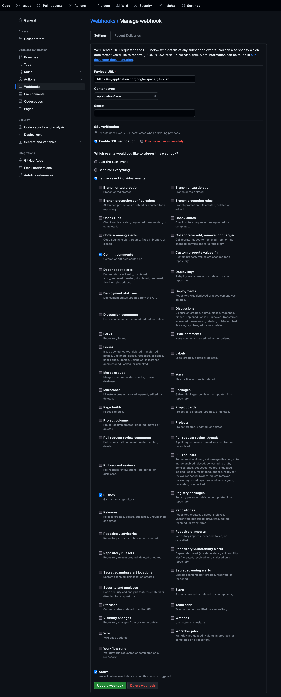

# Daisy - GitHub Notification Bot

A python web-framework for sending notification to someone's device, 
if an event occurred to specific repository in Github.

## Setup

To setup the environment, run these commands.

	pip install -r requirements.txt

## Environment Variables for sending the notification.

- `GOOGLE_SPACE_WEBHOOK`: Google space webhook URL if you are using Google space.

## Configuring the Bot and styling the messages
The bots are declared in the file `bots.py` in `application` directory the bot is customisable.

## Endpoints for specific github notification.

### Google Space

#### Git push and commits

##### API Endpoint : `/google-space/git-push`

**Github configuration**

## To run the application
	flask run

